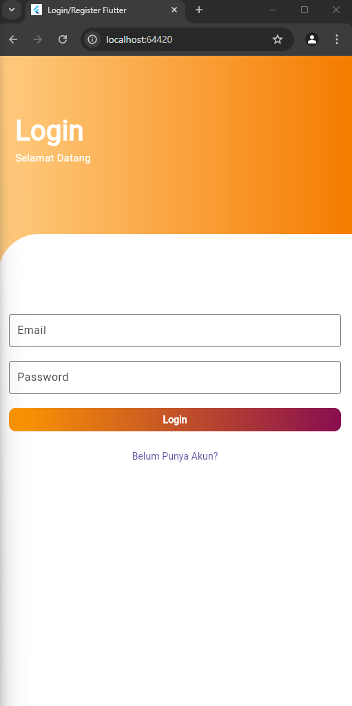
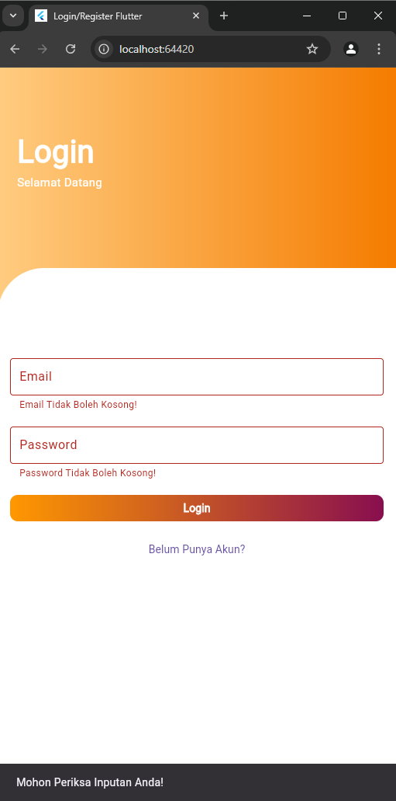
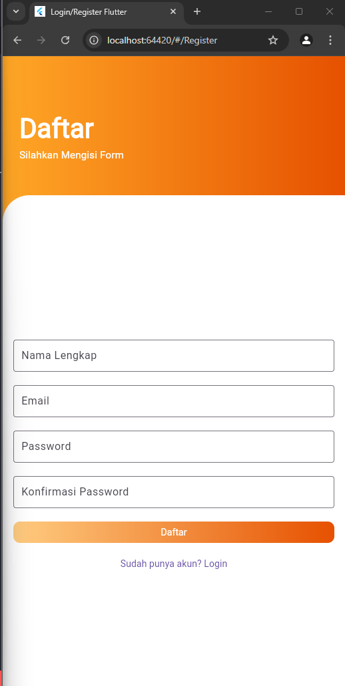
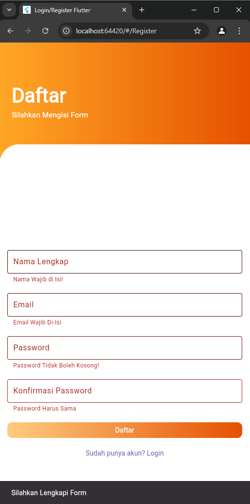
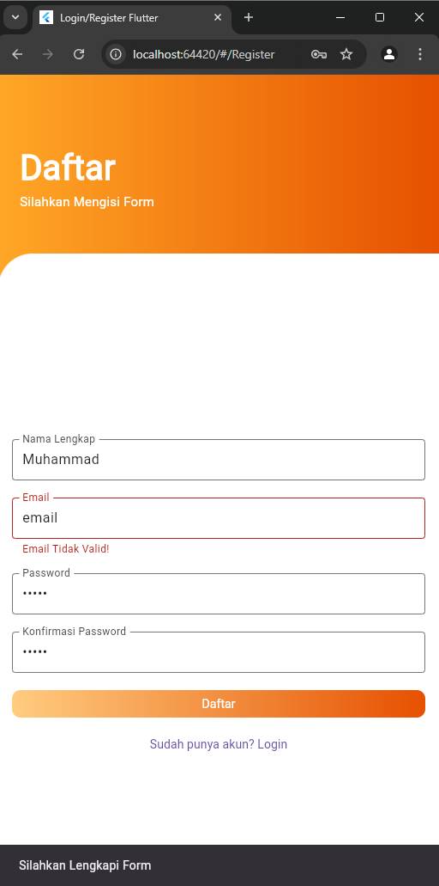
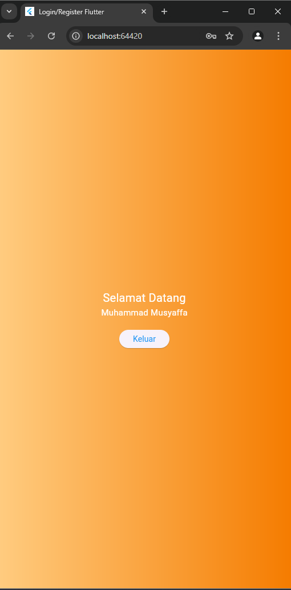

Ujian Tengah Semester

1. Halaman Login

2. Jika Email form atau password = null 

3. Halaman Registrasi

4. Jika Form tidak terisi

5. Memvalidai Email atau bukan, jika tidak akan muncul tulisan "Tidak Valid"

6. Hasil Ketika sudah melakukan registrasi dan login
